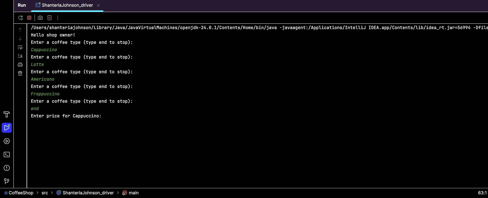
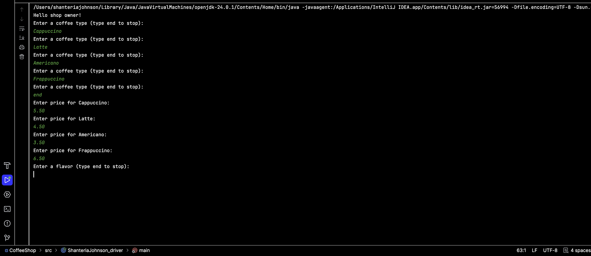
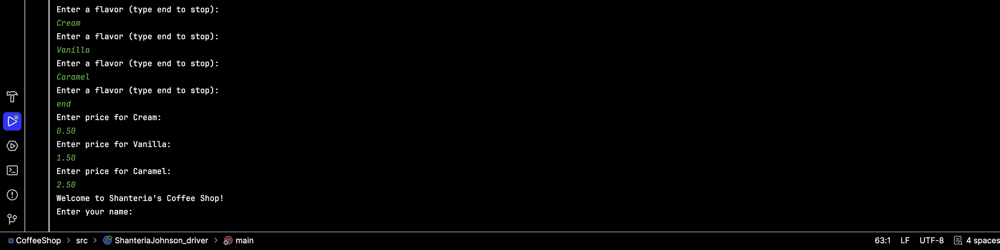
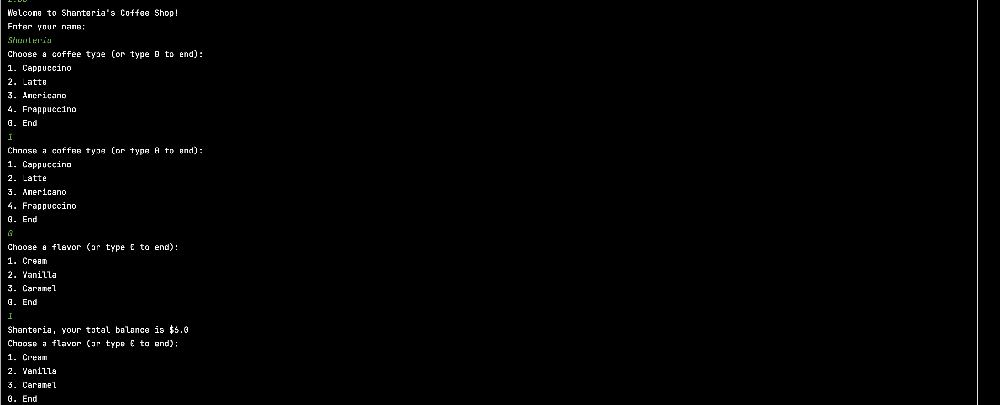
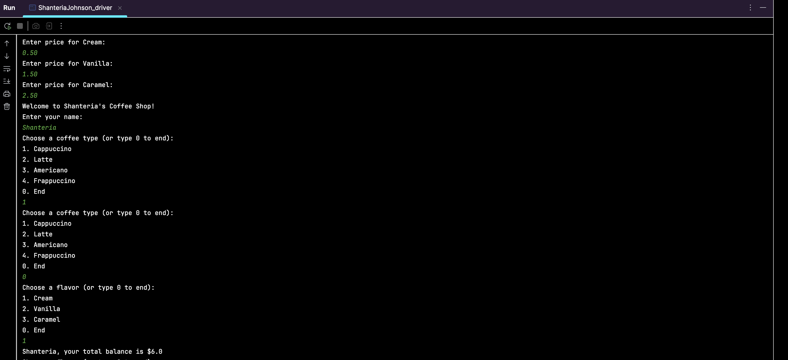
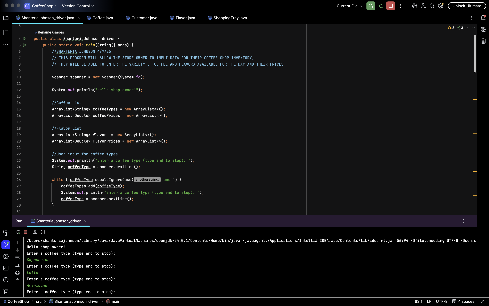

# Coffee Shop Ordering System

A Java console-based ordering system that simulates a coffee shop transaction, including customer selections, flavor options, pricing calculations, and order organization using multiple classes.

## Project Overview
This project was created for my Programming Fundamentals course to practice object-oriented programming and structured problem-solving in Java.

The program allows a customer to select coffee options, choose flavors, and calculate the total price of their order.

## Skills Demonstrated
- Java programming
- Object-oriented programming
- Classes and objects
- Constructors and methods
- Conditional logic
- User input
- Arrays/menu selections
- Price calculations
- Multi-class program organization

## Classes Used
- `Customer`
- `Coffee`
- `Flavor`
- `ShoppingTray`
- `ShanteriaJohnson_Driver`

## Business Connection
This project connects programming fundamentals to a real-world business workflow. A coffee shop ordering system requires customer input, menu options, pricing logic, and transaction flow, which are the same types of structured processes used in business and operational systems.

## Future Improvements
- Add inventory tracking
- Store order history in a database
- Add SQL integration
- Generate daily sales reports
- Create a simple dashboard for order trends

## Screenshots

### Program Setup & Coffee Inventory Input
This section allows the shop owner to enter coffee types and inventory information for the coffee shop system.

---

### Coffee & Pricing Input
The system allows coffee pricing information to be entered dynamically through user input, simulating menu setup and operational configuration.

---

### Flavor Configuration Input
The program supports customizable flavor options and flavor pricing additions for customer orders.

---

### Customer Ordering Workflow
Customers can select coffee options and flavors through a menu-driven ordering process.

---

### Order Processing & Balance Calculation
The program calculates customer totals based on selected menu items and flavor additions.

---

### Multi-Class Java Structure
The project uses multiple Java classes to organize customer data, coffee selections, flavors, and shopping tray functionality.

